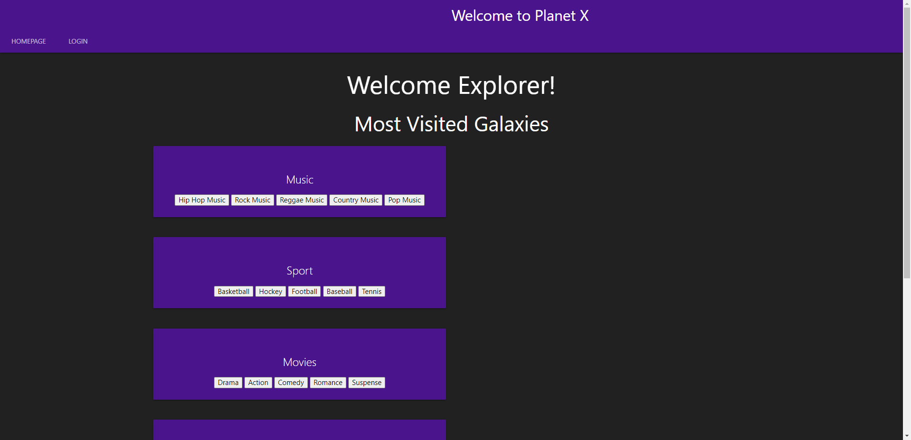
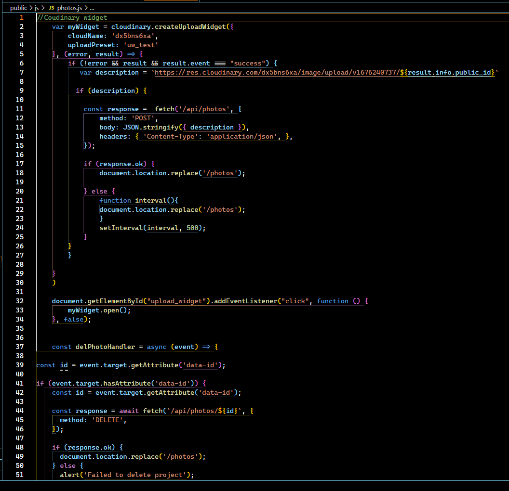

# PlanetX

## Technology Used

| Technology Used         | Resource URL           | 
| ------------- |:-------------:|  
| Git | [https://git-scm.com/](https://git-scm.com/)     |    
| JavaScript | [https://developer.mozilla.org/en-US/docs/Web/JavaScript](https://developer.mozilla.org/en-US/docs/Web/JavaScript)  |
| MySQL | [https://www.mysql.com/](https://www.mysql.com/)     |    
| MySQL2 | [https://www.npmjs.com/package/mysql2](https://www.npmjs.com/package/mysql2)  |
| Sequelize | [https://www.npmjs.com/package/sequelize](https://www.npmjs.com/package/sequelize)  |
| dotenv | [https://www.npmjs.com/package/dotenv](https://www.npmjs.com/package/dotenv)  |
| express-handlebars | [https://www.npmjs.com/package/express-handlebars](https://www.npmjs.com/package/express-handlebars)  |
| express-session | [https://www.npmjs.com/package/express-session](https://www.npmjs.com/package/express-session)  |
| connect-session-sequelize | [https://www.npmjs.com/package/connect-session-sequelize](https://www.npmjs.com/package/connect-session-sequelize)  |
| bcrypt | [https://www.npmjs.com/package/bcrypt](https://www.npmjs.com/package/bcrypt)  |
| Cloudinary | [https://cloudinary.com/](https://cloudinary.com/)  |
| Materialize | [https://materializecss.com/getting-started.html](https://materializecss.com/getting-started.html)  |

## Description
Space themed blog website that allows users to discuss topics with each other. Users can create an account and use the created account to login and logout. Login status will persist. Allows users to browse sub genres that are nested within genres. Allows users to create posts within subgenres. There is a photo section that allows users to upload photos from their local machine.

[Link to deployed website!](https://planetxapp-jbe.herokuapp.com/)

## Usage
You can create a new account by using the sign up form or login to a seeded account by entering test@test.com with a password of pass1. This will allow you to access all the features on our website. You can save photos, create posts and view other posts from other users.

## Learning Points 
1. How to create multilevel relationships between models:
    We used through/join tables to link many to many relationships between users, subgenres and blog posts. This allowed us to pass information to our routes to get specific posts and specific sub genres.
2. How to pass information between routes:
    Using our relationships we can pass information to our routes that manipulates our database. We can target user ids, genre ids and sub genre ids from other models because of our relationships we have established.
3. How to implement cloudinary and get it functioning:
    Cloudinary allows you to use their cloud storage to store photos and in turn gives you a URL to save to our database so it can be called on easily. They also supply a widget to upload photos from your pc, Facebook, Instagram and many other places.

## Author Info

### Brett Santor
* [Github](https://github.com/BrettSantor)
### Emil Ronquillo
* [Github](https://github.com/Emil1577)
### John Ho
* [Github](https://github.com/SpectreKilo)